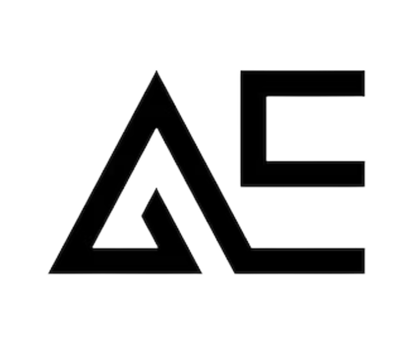

<a name="readme-top"></a>

<!--
HOW TO USE:
This is an example of how you may give instructions on setting up your project locally.

Modify this file to match your project and remove sections that don't apply.

REQUIRED SECTIONS:
- Table of Contents
- About the Project
  - Built With
  - Live Demo
- Getting Started
- Authors
- Future Features
- Contributing
- Show your support
- Acknowledgements
- License

OPTIONAL SECTIONS:
- FAQ

After you're finished please remove all the comments and instructions!
-->

<div align="center">
  <!-- You are encouraged to replace this logo with your own! Otherwise you can also remove it. -->
  
  <br/>

  <h3><b>AEDYA Chat Game</b></h3>

</div>


# 📗 Table of Contents

- [📖 About the Project](#about-project)
  - [🛠 Built With](#built-with)
    - [Tech Stack](#tech-stack)
    - [Key Features](#key-features)
  - [🚀 Live Demo](#live-demo)
  - [💻 Project Presentation](#presentation)
- [💻 Getting Started](#getting-started)
  - [Setup](#setup)
  - [Prerequisites](#prerequisites)
- [👥 Authors](#authors)
- [🔭 Future Features](#future-features)
- [🤝 Contributing](#contributing)
- [⭐️ Show your support](#support)
- [🙏 Acknowledgements](#acknowledgements)
- [❓ FAQ (OPTIONAL)](#faq)
- [📝 License](#license)

<!-- PROJECT DESCRIPTION  -->

# 📖 AEDYA Chat Game <a name="about-project"></a>

AEDYA Chat Game is an innovative project that aims to revolutionize the way people connect and interact through a captivating chat application. The primary objective of this project is to provide users from different countries with an immersive and engaging platform where they can register and participate in exciting chat games.

The core concept of AEDYA Chat Game revolves around fostering connections and communication. It encourages players to engage with one another, building relationships, and competing for rewards. The game emphasizes the idea that, ultimately, individuals are responsible for their own journey and success.

One of the key highlights of AEDYA Chat Game is its range of features designed to enhance the user experience. Users can register and create personalized profiles, allowing them to showcase their personalities and interests. The chat functionality enables real-time communication between players, creating a dynamic and interactive environment. Additionally, the game offers various chat games that challenge players' wit, creativity, and strategic thinking.

Behind the scenes, AEDYA Chat Game boasts a well-designed architecture that ensures seamless performance and scalability. The application leverages cutting-edge technologies to deliver a smooth and immersive user experience. The development team prioritizes user feedback and continuously updates and improves the platform to meet the evolving needs and expectations of the community.

In summary, AEDYA Chat Game is a groundbreaking project that combines the elements of chat, gaming, and social interaction. By providing users with an engaging platform for communication and competition, it aims to bring people from different backgrounds together. With its innovative features and robust architecture, AEDYA Chat Game offers a unique and captivating experience for users seeking fun, connection, and rewards.

## 🛠 Built With <a name="built-with"></a>

### Tech Stack <a name="tech-stack"></a>
- HTML/CSS/JS/JSX
- Stack frontend: React/Redux/React-Redux/Router
- Stack backend: Flask/Redis/Mysql


<!-- Features -->

### Key Features <a name="key-features"></a>
**Flask API**
**React/Redux frontend**
**Chat application plus game**

<p align="right">(<a href="#readme-top">back to top</a>)</p>
<!-- GETTING STARTED -->

## 💻 Getting Started <a name="getting-started"></a>
To get a local copy up and running, follow these steps.
- Open the index.html with a web browser (Chrome, Firefox, Safari...)

### Prerequisites

In order to run this project you need:
- A web browser (Chrome, Firefox, Safari...)
<!--
Example command:

```sh
 gem install rails
```
 -->

### Setup
Clone the repository to desired directory on local computer.
> `git clone https://github.com/wacoo/aedya-chat-game`

> `cd aedya-chat-game`

> `npm install`

> `npm start`

## 👥 Author <a name="authors"></a>
- GitHub: [@wacoo](https://github.com/wacoo)
- Twitter: [@wabaham9](https://twitter.com/wabaham9)
- LinkedIn: [LinkedIn](https://linkedin.com/in/wondmagegn-abriham-b867289a)

<p align="right">(<a href="#readme-top">back to top</a>)</p>

<!-- FUTURE FEATURES -->

## 🔭 Future Features <a name="future-features"></a>
[List of future works]
<p align="right">(<a href="#readme-top">back to top</a>)</p>

<!-- CONTRIBUTING -->

## 🤝 Contributing <a name="contributing"></a>

Contributions, issues, and feature requests are welcome!

Feel free to check the [issues page](../../issues/).

<p align="right">(<a href="#readme-top">back to top</a>)</p>

<!-- SUPPORT -->

## ⭐️ Show your support <a name="support"></a>

- We are freelance developers. If you like our work, please support us by spreading the word.

<p align="right">(<a href="#readme-top">back to top</a>)</p>

<!-- ACKNOWLEDGEMENTS -->

## 🙏 Acknowledgments <a name="acknowledgements"></a>
- We want to thank all my clients for their patronage.

<p align="right">(<a href="#readme-top">back to top</a>)</p>

<!-- FAQ (optional) -->

## ❓ FAQ (OPTIONAL) <a name="faq"></a>
- **How can I find you?**

  - Please find our contact information below.

- **Can you give me a price range for your services?**

  - To get price range, please contact us with: wabaham9@gmail.com

<p align="right">(<a href="#readme-top">back to top</a>)</p>

<!-- LICENSE -->

## 📝 License <a name="license"></a>

This project is [MIT](MIT.md) licensed.
